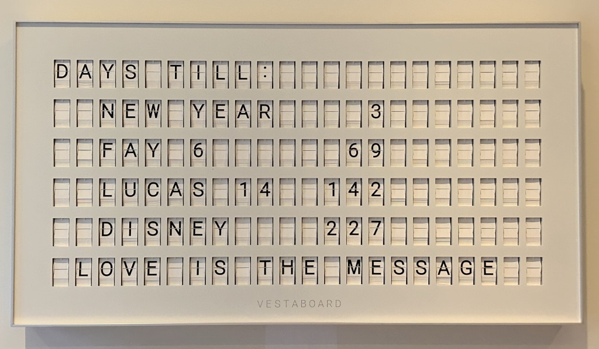

# Vestaboard Countdown
 
 ⚠ **Important**: To run this, you need a config file. See the bottom of this README for more information. 

## The Goal
My goal was to create a countdown on our new Vestaboard. I wanted to be able to set the date and time of the event and have the countdown display the days until the event. I also wanted to find a way for my family members to easily modify the list of events and their dates without my direct involvement.

<div align="center">

</div>

## The Solution
Vestaboard has a local API that allows you to update the contents of the board. I created a cron job that runs once a day and loads the content of a Google Sheet. The Google Sheet contains the list of events and their dates. The cron job then updates the Vestaboard with the countdown in number of days until each event.

So step-by-step:
- Google sheet with list of events and their dates
- Python script that reads the Google sheet and calls the local API
- Cron job that runs the Python script once a day

<div align="center">

</div>

### Vestaboard API
First things first: Vestaboard also has a cloud-based API, but I like to use local APIs as much as possible. This removes reliance on Vestaboard's servers and allows me to update the board even if their services are down. The API is very simple and allows you to read and write the contents of the board. The API is documented here: https://docs.vestaboard.com/local.

To make use of the Local API, you have to request an API token using [this form](https://www.vestaboard.com/local-api). You will then have to wait for an approval email from Vestaboard with the local API token in it, in plain text. I find this manual process a bit silly: The cloud-based API credentials *can* be created in the developer portal but the local API requires a manual request. Perhaps this manual process is temporary: I hope Vestaboard will add the ability to create and maintain local API credentials in the developer portal. 

⚠ **Warning:** Remember to keep your local API token secret. Consider deleting the e-mail containing it.

### Google Sheet
To allow my family members to update the list of events, I created a Google Sheet that they have access to. The sheet contains the list of events and their dates, a flag to switch on and off the display of these events, and a message to display with a flag as well.

<div align="center">

</div>

Sheets can be published to the web and can be accessed using a public URL. To do this, go to the `File` menu, then `Share` and `Publish to web`. Then on the dialog that opens just click "Publish" as the default settings are fine. A URL will be generated that you can use to access the sheet.

<div align="center">

</div>

After publishing the sheet, you can revising the same dialog and select `Comma-separated values (.csv)` as the format. This will generate a URL that you can use to access the sheet in CSV format. This is the URL that I use in my Python script.


<div align="center">

</div>

### Python script
I am using Python to create the cron job. It calls the published Google Sheet and reads its contents. Then I iterate over the lines and form a list of events (and an optional message). The total number of lines that can be displayed is six, so I append empty lines if needed. 

The Vestaboard local API expects not simply ASCII lines but instead only accepts a string like this with [specific character codes](https://docs.vestaboard.com/characters):
```
[[4, 1, 25, 19, 0, 20, 9, 12, 12, 50, 0, 0, 0, 0, 0, 0, 0, 0, 0, 0, 0, 0], 
[0, 0, 6, 1, 25, 0, 32, 0, 0, 0, 0, 0, 0, 29, 34, 0, 0, 0, 0, 0, 0, 0], 
[0, 0, 12, 21, 3, 1, 19, 0, 27, 30, 0, 0, 27, 27, 27, 0, 0, 0, 0, 0, 0, 0],
[0, 0, 4, 9, 19, 14, 5, 25, 0, 0, 0, 0, 27, 35, 32, 0, 0, 0, 0, 0, 0, 0],
[0, 0, 0, 0, 0, 0, 0, 0, 0, 0, 0, 0, 0, 0, 0, 0, 0, 0, 0, 0, 0, 0],
[0, 12, 15, 22, 5, 0, 9, 19, 0, 20, 8, 5, 0, 13, 5, 19, 19, 1, 7, 5, 0, 0]]
```

To build up these lines I make use of the Python library [Vestaboard](https://github.com/ShaneSutro/Vestaboard) and specifically its `convertLine` method. This method takes a string and converts it to the correct character codes. I then use the `urllib.request` [library](https://docs.python.org/3/library/urllib.request.html#module-urllib.request) to call the Vestaboard local API and update the board. I would have used the Vestaboard library, but it does not support the local API (yet).

### Cron Job
Finally, I created a CRON job that runs the Python script once a day. I am using crontab on my local Intel NUC.

I also created a Flask app that allows me to run the script on-demand. This allows me to update the board without waiting for the cron job to run.

### The Code
First we import the libraries we need, and the config file:
```python
import csv, urllib.request, os
from datetime import date, datetime
from vestaboard.formatter import Formatter
import config

URL = config.googlesheets_url
```
Then we define the function that will calculate the number of days until a future date: 
```python
def days_until(futuredate):
    futuredate = datetime.date(datetime.strptime(futuredate, "%Y-%m-%d"))
    return abs((futuredate - date.today()).days)
```

Next we define the function that will update the Vestaboard. First we read the CSV file from the Google Sheet, and define variables that will keep track of Events:
```python
def update_vestaboard():
    response = urllib.request.urlopen(URL)
    lines = [l.decode('utf-8') for l in response.readlines()]
    cr = csv.reader(lines)

    lineNum = 0
    state = 'START'
    showEvents = False
    showMessage = False
    events = []
    message = ''
```

Then we loop over the contents of the CSV file and build up the list of events and the message. Note that the CSV file has flags for displaying the Events and Message, so we only add them to the list if the flag is set to `ON`:
```python
    for row in cr:
        lineNum += 1
        match row[0]:
            case "DAYS UNTIL":
                state = 'DAYS UNTIL'
                if (row[1] == 'ON'):
                    showEvents = True
            case "MESSAGE":
                state = 'MESSAGE'
                if (row[1] == 'ON'):
                    showMessage = True
            case default:
                match state:
                    case 'DAYS UNTIL':
                        if (showEvents and row[0] != '' and row[1] != ''):
                            events.append([row[0], str(days_until(row[1]))])
                    case 'MESSAGE':
                        if (showMessage and row[0] != ''):
                            message += row[0]
```

We then create the actual lines that need to be sent to the Vestaboard. We first create the lines for the events, and then the line for the message. Note that we use the `convertLine` method from the Vestaboard library to convert the string to the correct character codes:
```python
    lines = []

    # Create the list of event lines to send to the Vestaboard
    if showEvents:
        lines.append(Formatter().convertLine('DAYS TILL:', justify='left'))
        for event in events:
            lines.append(Formatter().convertLine('  ' + event[0].ljust(10) + event[1].rjust(3), justify='left'))
    # Create the message line and add it to the lines to send to the Vestaboard
    if showMessage:
        for i in range (5 - len(lines)):
            lines.append(Formatter().convertLine(''))
        lines.append(Formatter().convertLine(message, justify='center'))
```      

At the end, because the Vestaboard supports 6 lines in total, we need to add empty lines if there are less than 6 lines:
```python
    # Add blank lines to the end of the lines to send to the Vestaboard if there are less than 6 lines
    if len(lines) < 6:
        for i in range(6 - len(lines)):
            lines.append(Formatter().convertLine(''))
```

Finally, we send the lines to the Vestaboard local API using the `urllib.request` library:
```python
    req = urllib.request.Request('http://' + config.vestaboard_ip + ':7000/local-api/message', method="POST")
    req.add_header('X-Vestaboard-Local-Api-Key', config.vestaboard_key)
    data = str(lines)
    data = data.encode()
    r = urllib.request.urlopen(req, data=data)
```

### Config file
You will need to add a config.py file with the following contents:

```
googlesheets_url='https://docs.google.com/spreadsheets/<really_long_string>/pub?output=csv'
vestaboard_ip='<local_ip_of_vestaboard>'
vestaboard_key='<local_api_key>'
```
Mind that you pick the CSV format of the Google Sheet. 